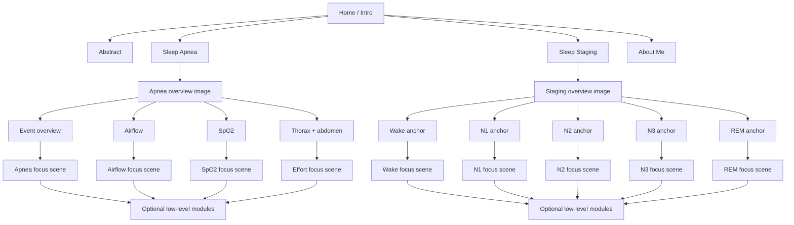

# Showcase Prototype Brief

## Purpose

This is the single working doc for the showcase prototype.

The prototype should not feel like a stack of pages or controls. It should feel like a guided reading of evidence from one night study.

The story comes first. Interaction exists only to move the user from broad clinical claim to the signal evidence that supports it.

The current implementation is not the source of truth. The flow in this brief is the source of truth.

If the current layout, motion, or component structure conflicts with the story, it should be changed rather than defended.

## Product story

The user should understand the project structure immediately:

- this system reads one night of physiologic data
- the project has shallow top-level branches
- apnea and staging are parallel scientific stories, not sequential steps
- each branch can open optional depth without forcing the user through all detail

The prototype is not trying to teach site navigation.

It is trying to let the user choose between parallel readings:

1. apnea: this is an obstructive apnea and here is why
2. staging: this night moves through recognizable sleep stages and here is why
3. abstract: this is the project at a glance
4. about: this is the lightweight portfolio branch

## Structure principle

The structure has two dimensions and should stay that way.

### Across the project

This is shallow and immediately legible.

- Home / Intro
- Abstract
- Sleep Apnea
- Sleep Staging
- About Me

These are sibling branches.

The user should be able to move across them without feeling trapped in a single storyline.

### Within a scientific branch

Depth works like this:

- simple explanation
- evidence image
- algorithm or feature interpretation
- optional low-level depth

This depth is entered from the image itself.

Text follows the image. Text does not lead the image.

Popup modules are reserved for low-level detail only. They are not the primary drill-down.

## Interaction grammar

There are only three valid depths once the user is inside a branch.

The visual treatment is flexible. The depth logic is not.

### Depth 1: overview scene

This is the chapter entry.

- one large image
- a small number of hotspot dots
- hover reveals only a short label
- click selects a focal point and transitions into the next scene

This scene should answer: what is the main thing in this branch that I should look at first?

### Depth 2: focus scene

This is a new image, not a crop of the same image.

- the selected focal point becomes a dedicated evidence composition
- unrelated signals fade away completely
- the right-side text updates to only the selected idea
- the back affordance returns to the exact previous overview state

This scene should answer: what is the core evidence for the focal point I selected?

### Depth 3: detail module

This is where popup modules belong.

- threshold definitions
- derived feature values
- metric snippets
- small supporting notes

This scene should answer: what extra detail is available if I choose to inspect it?

## Branch map

The project-level map should stay shallow:

```text
                    HOME / INTRO
                        │
       ┌────────────────┼────────────────┐
       │                │                │
    Abstract       Sleep Apnea      Sleep Staging
       │                │                │
 project summary   apnea story       staging story
       │
       └────────────────────────────── About Me
```

This means the prototype should not behave like:

- Home -> Abstract -> Apnea -> Staging -> About

That is too linear.

It should behave like:

- Home exposes branches
- entering a branch opens that branch's own image-driven story
- depth stays local to the chosen branch
- backing out returns to the branch overview, not to a forced next chapter

## Apnea story

### Clinical claim

This branch should tell one clean story:

- there is a respiratory event
- it meets apnea-style reduction criteria
- the effort pattern is obstructive rather than central
- oxygen desaturation provides downstream consequence

### Overview image

The overview image should be a real obstructive apnea strip spanning wide across the scene.

Signals shown in the overview:

- airflow
- thoracic effort
- abdominal effort
- SpO2
- event truth or obstruction bounds overlay

The overview should also show a subtle transparent event window behind the relevant time span.

### Apnea focal points

There should be four top-level selections.

1. Event overview
   What it means:
   This is the highest-level dot. It opens the clinical overview of the obstructive apnea event.

   What the focus scene shows:
   The full obstructive event strip again, but with the event bounds and a short clinical definition.

2. Airflow reduction
   What it means:
   This is the entry into apnea definition logic.

   What the focus scene shows:
   Only the airflow signal, with visual measures for reduced amplitude and duration greater than 10 seconds.

3. SpO2 drop
   What it means:
   This supports physiologic consequence.

   What the focus scene shows:
   Only the SpO2 trace, with the relevant drop annotated, using the 3% change as the visible teaching cue.

4. Thorax and abdomen together
   What it means:
   This is the obstruction-focused entry.

   What the focus scene shows:
   Thoracic and abdominal effort together, plus any derived correlation or paradox view needed to show out-of-phase effort.

Do not treat thorax and abdomen as two separate top-level stories. They are one paired obstructive evidence story.

### Apnea selection rules

- Hovering airflow highlights airflow only.
- Hovering SpO2 highlights SpO2 only.
- Hovering effort highlights thoracic and abdominal together.
- Clicking any of those moves into a new focus scene for that evidence.
- The overview dot is visually highest and opens the broad event explanation.

## Sleep staging story

### Clinical claim

This branch should tell a different kind of story:

- this is the structure of the whole night
- here are recognizable stage segments across that night
- picking a segment loads a stage-specific signal example
- that example shows why the label makes sense

### Overview image

The overview image should be a full-night hypnogram as a horizontal strip.

The hypnogram should:

- span wide across the scene
- use clear stage colors
- read as a night trajectory, not as a chart widget
- contain stage anchors at curated example times

The anchors are not generic tabs. They are chosen examples from the night.

### Staging focal points

The top-level staging selections are the stage anchors themselves.

Recommended anchor set:

- Wake
- N1
- N2
- N3
- REM

Clicking an anchor should not zoom into the existing hypnogram. It should replace the scene with a dedicated signal composition for that chosen example.

### Staging focus scenes

Each selected stage loads a new evidence image with only the stage-relevant channels.

Core signals for the stage focus scene:

- EEG
- EOG
- EMG

Each stage scene should emphasize a different visible pattern:

- Wake: higher muscle tone and wake-like mixed activity
- N1: transition character, reduced alpha stability, early sleep onset feel
- N2: spindle or K-complex evidence when present
- N3: dominant slow-wave structure
- REM: low chin tone with characteristic eye movement pattern

The focus scene is not yet a full scoring lesson. It only needs enough structure to make the stage label feel defensible.

## User flow diagram



The important rule is that branches open sideways at the project level, then deepen locally inside themselves.

## What the user should see first

The first read should be shallow and choice-oriented.

The user should first feel:

- there are a few major branches
- each branch has one dominant image
- I can choose where to go next
- depth is available if I want it

## What should not happen

The prototype should avoid these failure modes:

- showing every subsection at once
- forcing one scientific branch to be read before another
- using generic tabs as the primary navigation
- using a popup as the first drill-down
- keeping unrelated signals visible after a focal point is selected
- zooming into empty space instead of loading a new evidence composition
- making the user read navigation instructions to understand the page

## Data and exporter requirements

The frontend should render from exported artifacts rather than hardcoded placeholder scene data.

The exporter should make it easy to swap examples without rewriting the UI.

### Required apnea export shape

- record id
- selected event id or absolute start time
- event bounds
- airflow signal
- thoracic effort
- abdominal effort
- SpO2
- optional derived paradox or correlation signal
- event truth overlays
- feature values needed for annotations

### Required staging export shape

- record id
- full-night hypnogram
- curated stage anchors
- one signal example per anchor
- EEG, EOG, and EMG slices for that example
- optional stage-supporting features for later popup use

## Implementation priority

The next UI pass should follow this order:

1. restore the shallow branch structure at the project level
2. make each branch overview image own that branch's interaction
3. make each hotspot or anchor load a dedicated local focus scene
4. keep text synchronized to the chosen focal point only
5. reserve popup modules for low-level detail
6. polish motion only after the branch logic and local depth transitions are correct
